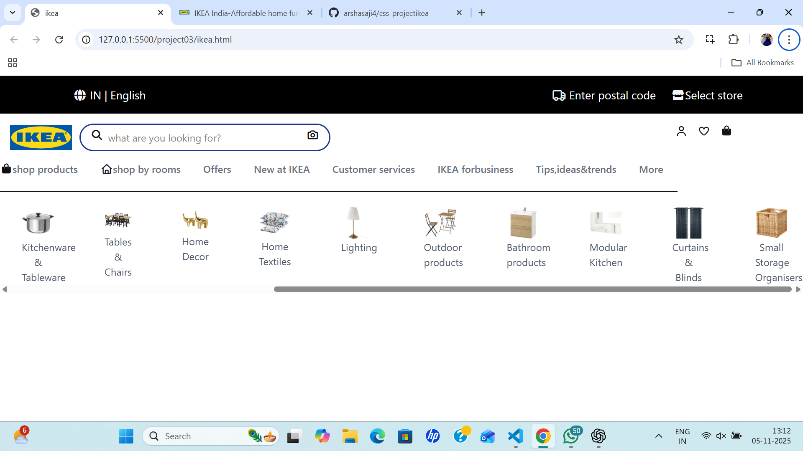

## 🏠 IKEA Front-End Website Clone
This project is a front-end clone of the IKEA India website, built using HTML, Tailwind CSS, and Font Awesome.
It focuses on responsive design, clean layout, and modern UI elements that resemble IKEA’s real online store.

## 🚀 Features

🖥 Responsive Navigation Bars – Two-level navigation including language, store selection, and product categories.

🔍 Search Bar – Styled with Tailwind CSS and Font Awesome icons.

🛍 Category Carousel – Scrollable list of product categories (furniture, decor, kitchenware, etc.).

## Preview

